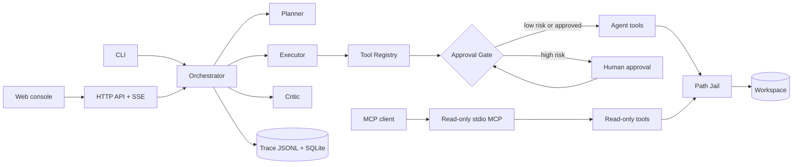

# RepoPilot

[](https://github.com/Jhy13294/RepoPilot-AI-Codebase-Agent/actions/workflows/ci.yml)

A task-oriented codebase agent: issue triage and patch proposal, with human approval required for
any mutation.

[中文文档](README.zh-CN.md)

RepoPilot is not a general chatbot. Given a repository and an issue, it plans, reads the code
through typed tools, locates the likely root cause, proposes a fix as a reviewable unified diff,
applies it only after explicit human approval, runs the tests, retries on failure within fixed
budgets, and produces a report together with a machine-readable execution trace.

## Demo


The CLI run shows the complete work-branch → patch proposal → per-action approval → test → commit
path ending in `DONE`.


The web console creates a run, streams live events, presents the complete diff for approval, and
keeps the terminal report in the run archive.

Reproduce either path with the bilingual [demo runbook](examples/README.md).

Status: all phases (0–9) are complete as of July 22, 2026. See the
[roadmap](docs/roadmap.md) for the as-built record and explicit non-goals.

## Design focus

- **Agent orchestration.** A hand-written Planner–Executor–Critic state machine on native tool
  calling. The reasons for not using an agent framework are documented in
  [tech selection](docs/tech-selection.md).
- **Tool calling.** Every tool has Pydantic argument/return schemas, a declared risk level,
  timeouts, output caps, and a uniform result envelope.
- **Human-in-the-loop safety.** High-risk actions (file writes, patches, test execution, git
  mutations) are intercepted by an approval gate enforced in code, not in prompts.
- **Failure recovery.** Typed errors map to typed strategies: argument repair, re-read and
  regenerate, bounded fix cycles.
- **Observability.** JSONL execution traces drive an evaluation harness measuring success rate,
  tool-call accuracy, recovery rate, and cost.

## Built capabilities

- **Repository Q&A.** Answers carry `file:line` citations, with deterministic grounding checks
  recording whether cited paths and lines resolve inside the selected repository.
- **Issue analysis.** Reports identify ranked suspect files, likely root cause, supporting
  citations, and confidence.
- **Approval-gated patch lifecycle.** A fix run creates or selects its work branch, proposes a
  unified diff, pauses before each high-risk action, applies the approved patch, runs the configured
  tests, and commits tracked changes.
- **Bounded repair and typed recovery.** Structured failures feed argument repair, re-reading,
  regeneration, and bounded fix cycles; a result-aware loop guard permits corrected retries after
  failure while blocking successful effective repeats.
- **Evaluation.** The harness covers repository Q&A, localization, explanation, patching, and
  recovery. Its [curated baseline](docs/evaluation.md#4-results-log-curated) preserves measured
  failures—including live recovery at 0/6—and distinguishes loop status from independent test
  results.
- **HTTP API and web console.** FastAPI exposes runs, cursor-based events, SSE, and approvals;
  Streamlit provides run creation, live events, full-diff approval, terminal reports, and archives.
- **Read-only MCP.** A stdio server exposes `get_file_tree`, `read_file`, and `search_code` through
  the same path jail, without mutation tools.
- **Container deployment.** One runtime image serves the API and console as two Compose services,
  with console startup gated on API health and run data persisted in a mounted volume.

## Architecture



Core loop, external surfaces, component responsibilities, and sequence diagrams:
[docs/architecture.md](docs/architecture.md).

## Quickstart

Run these commands from a clone of RepoPilot. Dependency installation, help, replay, and MCP reads
do not call an LLM provider. `ask`, `run`, and creating a run in the web console require a real
provider key in `.env`.

### CLI

```bash
git clone <this-repo>
cd RepoPilot
uv sync
cp .env.example .env   # fill OPENAI_API_KEY, or configure the Anthropic alternative

uv run repopilot ask "Where is date parsing handled?" --repo <path>
uv run repopilot run "Investigate why an empty config raises TypeError" --repo <path> --task-type issue
uv run repopilot run "Fix the reported bug and leave the tests green" --repo <path> --task-type fix
uv run repopilot replay <run_id>
```

The three LLM-backed commands above require a real key; `replay` reads an existing local JSONL
trace without contacting the provider. For a clean, disposable fix target, use the supplied demo:

```bash
python examples/prepare_demo.py --dest data/demo-workspace
uv run repopilot run "divide() returns the wrong sign; fix it so the tests pass" --repo data/demo-workspace --task-type fix
```

The fix command pauses for review before each high-risk branch, patch, test, and commit action. The
[demo runbook](examples/README.md) describes the fixture and both recorded paths.

### Docker Compose

```bash
cp .env.example .env   # fill a real provider key before creating an LLM-backed run
docker compose up --build
```

Open `http://127.0.0.1:8501`. Building the image and reaching the health-checked console are
keyless; creating a run requires the configured real key.

### MCP

```bash
uv run repopilot-mcp --repo <path>
```

This read-only stdio surface does not require a provider key. The installed entry point is
`repopilot-mcp --repo <path>`; client configuration and error semantics are documented in
[docs/mcp.md](docs/mcp.md).

## Safety model

1. Every tool declares a risk level: low, medium, or high.
2. High-risk tools (apply_patch, run_tests, git mutations) block until a human approves. The
   approver sees the actual diff and the agent's rationale.
3. All file paths are resolved through a sandbox jail. Patches are applied on a separate work
   branch, never on the user's branch. The commit tool includes tracked files only and never pushes.
4. There is no generic shell-execution tool. `run_tests` is the only subprocess boundary, and it
   runs the target repository's own test suite, so the repository itself must be trusted.

Details: [docs/human-in-the-loop.md](docs/human-in-the-loop.md).
Trust assumptions and known limitations: [Trust boundary & known limitations](docs/human-in-the-loop.md#7-trust-boundary--known-limitations).

## Documentation

The `docs/` directory records the architecture, safety model, evaluation design, implementation
decisions, and engineering lessons:

| Doc | Contents |
|---|---|
| [Learning notes](docs/learning-notes.md) | Implementation investigations and lessons (Chinese): symptom → fix → lesson |
| [Tech selection](docs/tech-selection.md) | Stack choices and the agent-framework decision |
| [Architecture](docs/architecture.md) | Components, data flow, key interfaces |
| [Agent design](docs/agent-design.md) | State machine, budgets, prompt architecture, context management |
| [Tool calling design](docs/tool-calling-design.md) | Registry pattern and per-tool specifications |
| [Human-in-the-loop](docs/human-in-the-loop.md) | Risk grading, approval flow, non-bypassability tests |
| [Failure recovery](docs/failure-recovery.md) | Error taxonomy and recovery strategies |
| [Evaluation](docs/evaluation.md) | Task types, metrics, harness design, results |
| [Roadmap](docs/roadmap.md) | Phases 0–9 with acceptance criteria |
| [Project management](docs/project-management.md) | Task lifecycle and definition of done |
| [Code style](docs/code-style.md) | Language policy, toolchain, typing, commit convention |

## Development process

Every task is defined with acceptance criteria before implementation and tracked on an internal
board; commits follow Conventional Commits with a traceable task ID trailer. The live board is not
committed—the methodology and its templates are public in
[docs/project-management.md](docs/project-management.md) and
[docs/internal-templates/](docs/internal-templates/).

## Tech stack

Python 3.12 · uv · FastAPI · Pydantic v2 · `deepseek-v4-pro` via the OpenAI-compatible SDK
(Anthropic adapter included) · SQLAlchemy 2.0 + SQLite · Streamlit · MCP Python SDK · pytest ·
ruff · mypy · Docker

## License

[MIT](LICENSE)
