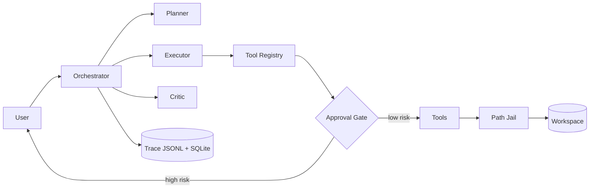

# RepoPilot

A task-oriented codebase agent: issue triage and patch proposal, with human approval required for
any mutation.

[中文文档](README.zh-CN.md)

RepoPilot is not a general chatbot. Given a repository and an issue, it plans, reads the code
through typed tools, locates the likely root cause, proposes a fix as a reviewable unified diff,
applies it only after explicit human approval, runs the tests, retries on failure within fixed
budgets, and produces a report together with a machine-readable execution trace.

Status: the Phase 0 skeleton (architecture, tool contracts, documentation) is complete.
Implementation proceeds phase by phase; see the [roadmap](docs/roadmap.md).

## Design focus

- **Agent orchestration.** A hand-written Planner–Executor–Critic state machine on native tool
  calling. The reasons for not using an agent framework are documented in
  [tech selection](docs/tech-selection.md).
- **Tool calling.** Every tool has Pydantic argument/return schemas, a declared risk level,
  timeouts, output caps, and a uniform result envelope.
- **Human-in-the-loop safety.** High-risk actions (file writes, patches, test execution, git
  mutations) are intercepted by an approval gate enforced in code, not in prompts.
- **Failure recovery.** Typed errors map to typed strategies: argument repair, re-read and
  regenerate, bounded fix cycles.
- **Observability.** JSONL execution traces drive an evaluation harness measuring success rate,
  tool-call accuracy, recovery rate, and cost.

## Planned capabilities

| Capability | Available from |
|---|---|
| Repository Q&A with file:line citations | Phase 2 |
| Issue analysis: suspected files, root cause, confidence | Phase 4 |
| Patch proposal as unified diff, applied only after approval | Phase 5 |
| Test execution with failure recovery and re-patching | Phase 6 |
| Metrics report across a task suite | Phase 7 |
| Web console with live trace and approval panel | Phase 8 |

## Architecture



Component responsibilities, data flow, and sequence diagrams: [docs/architecture.md](docs/architecture.md).

## Quickstart

Available from Phase 2.

```bash
git clone <this-repo> && cd RepoPilot
uv sync
cp .env.example .env   # set OPENAI_API_KEY (DeepSeek, default provider)
uv run repopilot ask ./path/to/repo "Where is date parsing handled?"
uv run repopilot run ./path/to/repo --issue "TypeError when config file is empty"
```

The default model is `deepseek-v4-pro` through DeepSeek's OpenAI-compatible endpoint. Switching
to Claude models is a `.env` change (`REPOPILOT_LLM_PROVIDER=anthropic`); no code changes.

## Safety model

1. Every tool declares a risk level: low, medium, or high.
2. High-risk tools (apply_patch, run_tests, git mutations) block until a human approves. The
   approver sees the actual diff and the agent's rationale.
3. All file paths are resolved through a sandbox jail. Patches are applied on a separate work
   branch, never on the user's branch.
4. There is no generic shell-execution tool.

Details: [docs/human-in-the-loop.md](docs/human-in-the-loop.md).

## Learning Notes / 学习笔记

Design rationale, trade-offs, and implementation notes are kept in `docs/` and written to be read:

| Doc | Contents |
|---|---|
| [Tech selection](docs/tech-selection.md) | Stack choices and the agent-framework decision |
| [Architecture](docs/architecture.md) | Components, data flow, key interfaces |
| [Agent design](docs/agent-design.md) | State machine, budgets, prompt architecture, context management |
| [Tool calling design](docs/tool-calling-design.md) | Registry pattern and per-tool specifications |
| [Human-in-the-loop](docs/human-in-the-loop.md) | Risk grading, approval flow, non-bypassability tests |
| [Failure recovery](docs/failure-recovery.md) | Error taxonomy and recovery strategies |
| [Evaluation](docs/evaluation.md) | Task types, metrics, harness design, results |
| [Roadmap](docs/roadmap.md) | Phases 0–9 with acceptance criteria |
| [Project management](docs/project-management.md) | Task lifecycle and definition of done |
| [Code style](docs/code-style.md) | Language policy, toolchain, typing, commit convention |

## Development process

Every task is defined with acceptance criteria before implementation and tracked on an internal
board; commits follow Conventional Commits with a traceable task ID trailer. The live board is not
committed — the methodology and its templates are public in
[docs/project-management.md](docs/project-management.md) and
[docs/internal-templates/](docs/internal-templates/).

## Tech stack

Python 3.12 · uv · FastAPI · Pydantic v2 · `deepseek-v4-pro` via the OpenAI-compatible SDK
(Anthropic adapter included) · SQLAlchemy 2.0 (SQLite, PostgreSQL-ready) · Streamlit · pytest ·
ruff · mypy · Docker

## License

[MIT](LICENSE)
