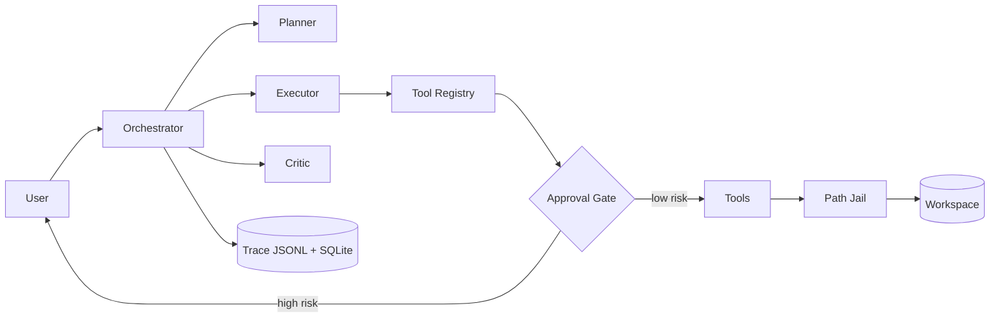

# RepoPilot 🛩️

**A task-oriented codebase agent: issue triage and patch proposal with human-in-the-loop safety.**

[中文文档 → README.zh-CN.md](README.zh-CN.md)

RepoPilot is **not a chatbot**. Give it a repository and an issue; it plans, navigates the code
with typed tools, locates the root cause, proposes a patch as a reviewable diff, waits for your
approval before touching anything, runs the tests, recovers from failures, and hands you a fix
report with a complete machine-readable execution trace.

> Status: **Phase 0 — docs-first skeleton.** Architecture and contracts are final; implementation
> lands phase by phase per the [roadmap](docs/roadmap.md).

## Why it exists

A portfolio project focused on the hard parts of LLM agent engineering:

- **Agent orchestration** — hand-rolled Planner–Executor–Critic state machine on native tool
  calling ([why no LangGraph](docs/tech-selection.md)).
- **Tool calling done properly** — every tool has Pydantic args/return schemas, a declared risk
  level, timeouts, truncation caps, and a uniform result envelope.
- **Human-in-the-loop safety** — high-risk actions (writes, patches, tests, git) are intercepted
  by an approval gate *in code*; the model is never trusted to self-police.
- **Failure recovery** — typed errors route to typed strategies (repair, re-read + regenerate,
  fix cycles), all budget-bounded.
- **Observability & evaluation** — JSONL traces power a metrics harness (success rate, tool-call
  accuracy, recovery rate, cost).

## What it can do (target capability, per phase)

| Capability | Phase |
|---|---|
| Answer questions about a repo with real file:line citations | P2 |
| Analyze an issue → suspected files + root cause + confidence | P4 |
| Propose a fix as a unified diff, apply it only after your approval | P5 |
| Run tests, recover from failures, re-patch within budgets | P6 |
| Metrics report across a task suite | P7 |
| Web console with live trace + approval panel | P8 |

## Architecture at a glance



Full picture with sequence diagrams: [docs/architecture.md](docs/architecture.md).

## Quickstart (available from Phase 2)

```bash
git clone <this-repo> && cd RepoPilot
uv sync
cp .env.example .env          # add your DeepSeek API key (default provider)
uv run repopilot ask ./path/to/repo "Where is date parsing handled?"
uv run repopilot run ./path/to/repo --issue "TypeError when config file is empty"
```

Default model: `deepseek-v4-pro` via DeepSeek's OpenAI-compatible endpoint. Provider-agnostic:
set `REPOPILOT_LLM_PROVIDER=anthropic` to use Claude models instead — a `.env` change, no code.

## Safety model (the short version)

1. Every tool declares `risk_level: low | medium | high`.
2. `high` (apply_patch, run_tests, git mutations) **blocks on explicit human approval** — you see
   the actual diff and the agent's rationale before anything happens.
3. All paths resolve through a sandbox jail; patches land on a `repopilot/fix-*` branch, never yours.
4. There is deliberately **no `run_shell` tool**.

Details: [docs/human-in-the-loop.md](docs/human-in-the-loop.md).

## 📚 Learning Notes / 学习笔记

> The documentation is a first-class deliverable — design rationale, trade-offs, and lessons,
> written to be read.

| Doc | What it covers |
|---|---|
| [Tech selection](docs/tech-selection.md) | Every stack choice + the LangGraph decision |
| [Architecture](docs/architecture.md) | Components, data flow, key interfaces, diagrams |
| [Agent design](docs/agent-design.md) | State machine, budgets, prompt architecture, context management |
| [Tool calling design](docs/tool-calling-design.md) | Registry pattern + full per-tool specs |
| [Human-in-the-loop](docs/human-in-the-loop.md) | Risk grading, approval flow, non-bypassability tests |
| [Failure recovery](docs/failure-recovery.md) | Error taxonomy → recovery strategies, anti-patterns |
| [Evaluation](docs/evaluation.md) | Task types, metrics, harness design, results log |
| [Roadmap](docs/roadmap.md) | Phases 0–9 with acceptance criteria |
| [Project management](docs/project-management.md) | Construction IDs, task lifecycle, definition of done |
| [Code style](docs/code-style.md) | Language policy, toolchain, typing, commit convention |

## Project methodology

Work is tracked with construction IDs (`RP-P1-FEAT-003`) that link the task board, branch names,
and commit trailers. The live board (`tasks/`, `memory/`) is gitignored; public templates live in
[docs/internal-templates/](docs/internal-templates/). Method: [docs/project-management.md](docs/project-management.md).

## Tech stack

Python 3.12 · uv · FastAPI · Pydantic v2 · DeepSeek `deepseek-v4-pro` via OpenAI-compatible SDK (+ Anthropic adapter) ·
SQLAlchemy 2.0 (SQLite → PostgreSQL) · Streamlit · pytest · ruff · mypy · Docker

## License

[MIT](LICENSE)
