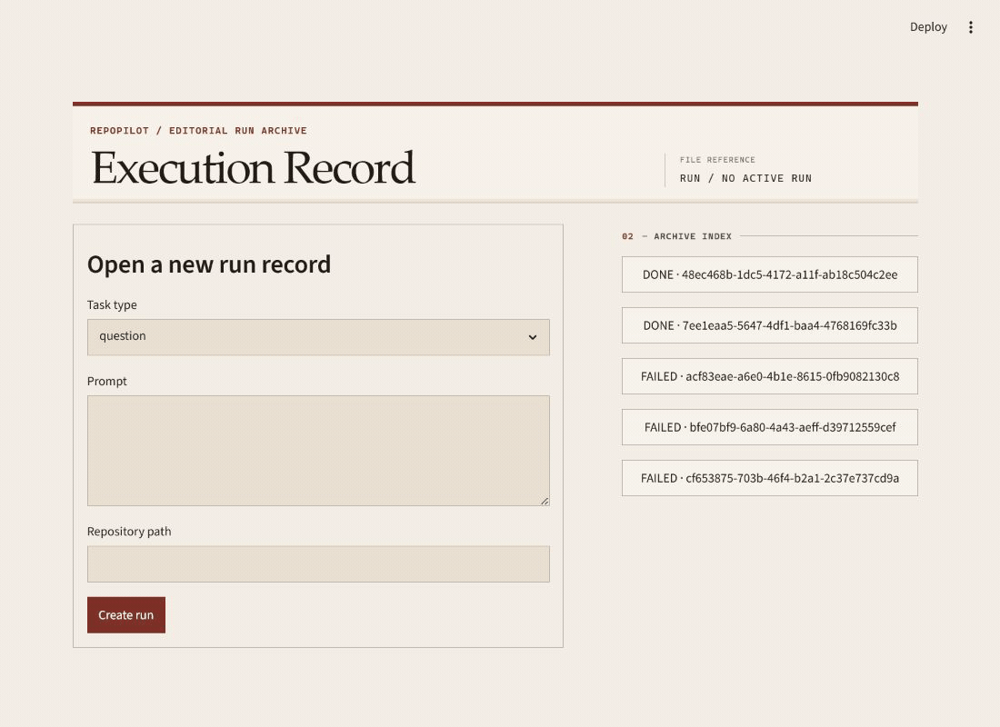
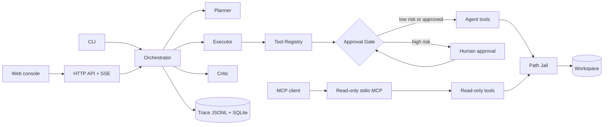

# RepoPilot

[](https://github.com/Jhy13294/RepoPilot-AI-Codebase-Agent/actions/workflows/ci.yml)

面向代码仓库的任务型 Agent：Issue 分析与补丁建议，任何变更操作都需人工批准。

[English](README.md)

RepoPilot 不是通用聊天机器人。给定一个仓库和一个 Issue，它会：制定计划，通过类型化工具阅读代码，
定位可能的根因，以可审查的 unified diff 形式提出修复，仅在人工明确批准后应用，随后运行测试，
失败时在固定预算内重试，最终输出修复报告和机器可读的执行轨迹。

## Demo


CLI 演示完整呈现工作分支 → 补丁提议 → 逐项审批 → 测试 → 提交，并最终到达 `DONE`。



Web 控制台演示创建 run、实时接收事件、在审批面板查看完整 diff，并把终态报告保留在 run 归档中。

两条路径都可按双语[演示 runbook](examples/README.md)复现。

状态：截至 2026-07-22，Phase 0–9 已全部完成。各阶段的实建记录与明确未建项见
[路线图](docs/roadmap.md)。

## 设计重点

- **Agent 编排。** 基于原生 tool calling 手写的 Planner–Executor–Critic 状态机；不使用 Agent
  框架的理由见[技术选型](docs/tech-selection.md)。
- **工具调用。** 每个工具都有 Pydantic 入/出参 schema、声明的风险等级、超时与输出上限，以及统一的
  结果信封。
- **Human-in-the-loop 安全。** 高风险动作（写文件、打补丁、执行测试、git 变更）由代码层的审批门
  拦截，而非依赖提示词。
- **失败恢复。** 类型化错误对应类型化策略：参数修复、重读后重新生成、有界修复循环。
- **可观测性。** JSONL 执行轨迹驱动评测框架，度量成功率、工具调用准确率、恢复率与成本。

## 已建成能力

- **仓库问答。** 回答携带 `file:line` 引用；确定性的 grounding 检查会记录引用路径与行号能否在
  所选仓库内解析。
- **Issue 分析。** 报告给出排序后的嫌疑文件、可能根因、证据引用与置信度。
- **审批门控的补丁全流程。** fix run 创建或选择工作分支，生成 unified diff，并在每个高风险动作
  前暂停；获批后应用补丁、运行配置好的测试并提交已跟踪变更。
- **有界修复与类型化恢复。** 结构化失败会进入参数修复、重读、重新生成和有界 fix cycle；
  结果感知的 LoopGuard 允许失败后的修正重试，同时阻止已成功的等效重复。
- **评测。** harness 覆盖仓库问答、定位、解释、补丁与恢复；[真实基线](docs/evaluation.md#4-results-log-curated)
  保留测得的失败——包括 live recovery 0/6——并区分 loop 状态与独立测试结果。
- **HTTP API 与 Web 控制台。** FastAPI 提供 run、游标事件、SSE 与审批接口；Streamlit 提供 run
  创建、实时事件、完整 diff 审批、终态报告与归档。
- **只读 MCP。** stdio server 通过同一套 path jail 暴露 `get_file_tree`、`read_file` 与
  `search_code`，不暴露变更工具。
- **容器部署。** 同一个运行时镜像作为两个 Compose 服务分别承载 API 与控制台；控制台启动受 API
  健康检查门控，run 数据保存在挂载卷中。

## 架构



核心循环、外部入口、组件职责与时序图见 [docs/architecture.md](docs/architecture.md)。

## 快速开始

以下命令从 RepoPilot 仓库根目录运行。安装依赖、查看 help、replay 与 MCP 只读调用不会访问 LLM
provider；`ask`、`run` 以及在 Web 控制台创建 run，需要在 `.env` 中配置真实 provider key。

### CLI

```bash
git clone <this-repo>
cd RepoPilot
uv sync
cp .env.example .env   # 填入 OPENAI_API_KEY，或配置 Anthropic 备选 provider

uv run repopilot ask "Where is date parsing handled?" --repo <path>
uv run repopilot run "Investigate why an empty config raises TypeError" --repo <path> --task-type issue
uv run repopilot run "Fix the reported bug and leave the tests green" --repo <path> --task-type fix
uv run repopilot replay <run_id>
```

前三条 LLM 命令需要真实 key；`replay` 只读取既有的本地 JSONL 轨迹，不联系 provider。需要一个干净、
可丢弃的 fix 目标时，使用随仓库提供的演示：

```bash
python examples/prepare_demo.py --dest data/demo-workspace
uv run repopilot run "divide() returns the wrong sign; fix it so the tests pass" --repo data/demo-workspace --task-type fix
```

fix 命令会在分支、补丁、测试和提交等每个高风险动作前暂停等待审查。fixture 与两条录制路径详见
[演示 runbook](examples/README.md)。

### Docker Compose

```bash
cp .env.example .env   # 创建 LLM run 前填入真实 provider key
docker compose up --build
```

打开 `http://127.0.0.1:8501`。构建镜像并到达受健康检查保护的控制台无需 key；创建 run 需要已配置的
真实 key。

### MCP

```bash
uv run repopilot-mcp --repo <path>
```

这个只读 stdio 入口不需要 provider key。安装后的入口命令是 `repopilot-mcp --repo <path>`；客户端
配置与错误语义见 [docs/mcp.md](docs/mcp.md)。

## 安全模型

1. 每个工具声明风险等级：low、medium 或 high；
2. 高风险工具（apply_patch、run_tests、git 变更）阻塞等待人工批准，审批人能看到真实 diff 和
   Agent 的理由；
3. 所有文件路径经沙箱校验；补丁只应用在独立工作分支上，绝不动用户分支。提交工具只包含已跟踪
   文件，并且绝不 push；
4. 不提供通用的 shell 执行工具。`run_tests` 是唯一的子进程边界，它运行的是目标仓库自己的测试套件，
   因此目标仓库本身必须可信。

详见 [docs/human-in-the-loop.md](docs/human-in-the-loop.md)。
信任假设与已知限制见：[Trust boundary & known limitations](docs/human-in-the-loop.md#7-trust-boundary--known-limitations)。

## 项目文档

`docs/` 收录架构、安全机制、评测设计、实现决策与工程复盘：

| 文档 | 内容 |
|---|---|
| [学习笔记](docs/learning-notes.md) | 实现问题复盘：现象 → 修复 → 经验 |
| [技术选型](docs/tech-selection.md) | 各项选择的理由与 Agent 框架取舍 |
| [架构设计](docs/architecture.md) | 组件、数据流、关键接口 |
| [Agent 设计](docs/agent-design.md) | 状态机、预算、Prompt 架构、上下文管理 |
| [工具调用设计](docs/tool-calling-design.md) | 注册中心模式与每个工具的规格 |
| [人工审批](docs/human-in-the-loop.md) | 风险分级、审批流、不可绕过性测试 |
| [失败恢复](docs/failure-recovery.md) | 错误分类与恢复策略 |
| [评测设计](docs/evaluation.md) | 任务类型、指标、评测框架与结果 |
| [路线图](docs/roadmap.md) | Phase 0–9 与验收标准 |
| [项目管理](docs/project-management.md) | 任务生命周期与完成定义 |
| [代码规范](docs/code-style.md) | 语言政策、工具链、类型、提交规范 |

## 开发流程

每个任务在实现前先定义验收标准并登记到内部看板；提交遵循 Conventional Commits 并携带可追溯的
任务编号尾注。内部看板不入库——方法论与模板公开在
[docs/project-management.md](docs/project-management.md) 与
[docs/internal-templates/](docs/internal-templates/)。

## 技术栈

Python 3.12 · uv · FastAPI · Pydantic v2 · `deepseek-v4-pro`（OpenAI 兼容 SDK，含 Anthropic
适配器）· SQLAlchemy 2.0 + SQLite · Streamlit · MCP Python SDK · pytest · ruff · mypy · Docker

## 许可证

[MIT](LICENSE)
