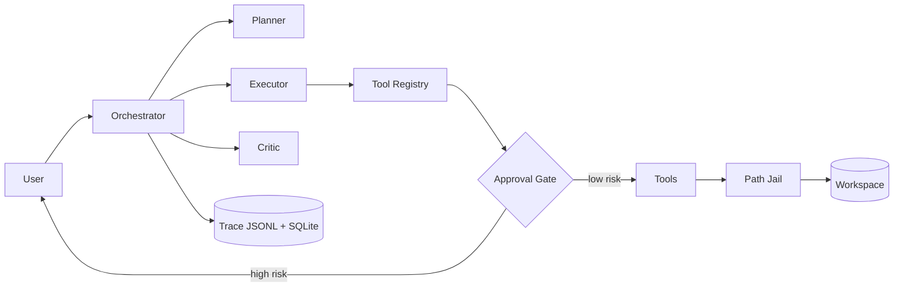

# RepoPilot

面向代码仓库的任务型 Agent：Issue 分析与补丁建议，任何变更操作都需人工批准。

[English](README.md)

RepoPilot 不是通用聊天机器人。给定一个仓库和一个 Issue，它会：制定计划，通过类型化工具阅读代码，
定位可能的根因，以可审查的 unified diff 形式提出修复，仅在人工明确批准后应用，随后运行测试，
失败时在固定预算内重试，最终输出修复报告和机器可读的执行轨迹。

状态：Phase 0 骨架（架构、工具契约、文档）已完成，功能按[路线图](docs/roadmap.md)逐阶段实现。

## 设计重点

- **Agent 编排。** 基于原生 tool calling 手写的 Planner–Executor–Critic 状态机；不使用 Agent
  框架的理由见[技术选型](docs/tech-selection.md)。
- **工具调用。** 每个工具都有 Pydantic 入/出参 schema、声明的风险等级、超时与输出上限，以及统一的
  结果信封。
- **Human-in-the-loop 安全。** 高风险动作（写文件、打补丁、执行测试、git 变更）由代码层的审批门
  拦截，而非依赖提示词。
- **失败恢复。** 类型化错误对应类型化策略：参数修复、重读后重新生成、有界修复循环。
- **可观测性。** JSONL 执行轨迹驱动评测框架，度量成功率、工具调用准确率、恢复率与成本。

## 能力规划

| 能力 | 交付阶段 |
|---|---|
| 带 file:line 引用的仓库问答 | Phase 2 |
| Issue 分析：嫌疑文件、根因、置信度 | Phase 4 |
| 生成 unified diff，批准后才应用 | Phase 5 |
| 测试执行、失败恢复与重新修复 | Phase 6 |
| 任务集指标评测报告 | Phase 7 |
| Web 控制台：实时轨迹与审批面板 | Phase 8 |

## 架构



组件职责、数据流与时序图见 [docs/architecture.md](docs/architecture.md)。

## 快速开始

Phase 2 起可用。

```bash
git clone <this-repo> && cd RepoPilot
uv sync
cp .env.example .env   # 填入 OPENAI_API_KEY（默认 provider 为 DeepSeek）
uv run repopilot ask ./path/to/repo "日期解析在哪里处理？"
uv run repopilot run ./path/to/repo --issue "配置文件为空时抛 TypeError"
```

默认模型为 `deepseek-v4-pro`（DeepSeek 的 OpenAI 兼容端点）。切换到 Claude 系列只需修改 `.env`
（`REPOPILOT_LLM_PROVIDER=anthropic`），无需改代码。

## 安全模型

1. 每个工具声明风险等级：low、medium 或 high；
2. 高风险工具（apply_patch、run_tests、git 变更）阻塞等待人工批准，审批人能看到真实 diff 和
   Agent 的理由；
3. 所有文件路径经沙箱校验；补丁只应用在独立工作分支上，绝不动用户分支；
4. 不提供通用的 shell 执行工具。

详见 [docs/human-in-the-loop.md](docs/human-in-the-loop.md)。

## Learning Notes / 学习笔记

设计取舍与实现笔记都在 `docs/` 中，写给人读：

| 文档 | 内容 |
|---|---|
| [学习笔记](docs/learning-notes.md) | 第一人称工程日志：现象 → 修复 → 经验 |
| [技术选型](docs/tech-selection.md) | 各项选择的理由与 Agent 框架取舍 |
| [架构设计](docs/architecture.md) | 组件、数据流、关键接口 |
| [Agent 设计](docs/agent-design.md) | 状态机、预算、Prompt 架构、上下文管理 |
| [工具调用设计](docs/tool-calling-design.md) | 注册中心模式与每个工具的规格 |
| [人工审批](docs/human-in-the-loop.md) | 风险分级、审批流、不可绕过性测试 |
| [失败恢复](docs/failure-recovery.md) | 错误分类与恢复策略 |
| [评测设计](docs/evaluation.md) | 任务类型、指标、评测框架与结果 |
| [路线图](docs/roadmap.md) | Phase 0–9 与验收标准 |
| [项目管理](docs/project-management.md) | 任务生命周期与完成定义 |
| [代码规范](docs/code-style.md) | 语言政策、工具链、类型、提交规范 |

## 开发流程

每个任务在实现前先定义验收标准并登记到内部看板；提交遵循 Conventional Commits 并携带可追溯的
任务编号尾注。内部看板不入库——方法论与模板公开在
[docs/project-management.md](docs/project-management.md) 与
[docs/internal-templates/](docs/internal-templates/)。

## 技术栈

Python 3.12 · uv · FastAPI · Pydantic v2 · `deepseek-v4-pro`（OpenAI 兼容 SDK，含 Anthropic
适配器）· SQLAlchemy 2.0（SQLite，可平移 PostgreSQL）· Streamlit · pytest · ruff · mypy · Docker

## 许可证

[MIT](LICENSE)
