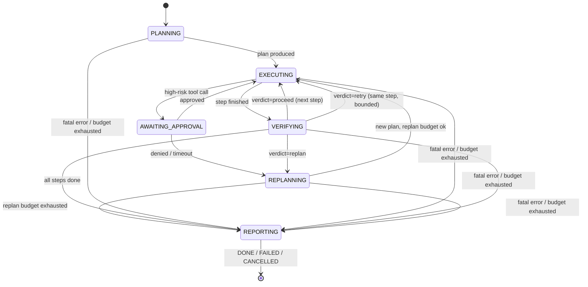

# Agent Design

## 1. Why Planner–Executor (with Critic), not a single ReAct loop

| Property | Single ReAct loop | Planner–Executor + Critic (chosen) |
|---|---|---|
| Explainability | Reasoning buried in one long transcript | Explicit `Plan` object; UI can render progress |
| Recovery | Retry = "try again harder" | Critic verdicts drive targeted `retry` / `replan` |
| Evaluability | Hard to score partial progress | Per-step `success_check` → step-level metrics |
| Cost control | Context grows monotonically | Steps run as bounded micro-loops over a summarized state |

The Executor still behaves ReAct-style *within a step* (think → tool → observe), but the step is
bounded, verified, and disposable.

## 2. Run state machine

Terminal statuses: `DONE` (task achieved), `FAILED` (budgets/denials exhausted — with report),
`CANCELLED` (user abort). **Every terminal path emits a report**; there is no silent death.
The transition table routes `fatal_or_budget` from `PLANNING`, `EXECUTING`, `VERIFYING`, and
`REPLANNING` to `REPORTING`. `AWAITING_APPROVAL` transitions are present in the table but dormant
until P5 because P3 has no high-risk tools that make the loop request approval. `cancel` also routes
any non-terminal status to `REPORTING`, but P3 does not expose a CLI cancel trigger yet.

## 3. Budgets (all from config, all enforced in the loop)

| Budget | Env var | Default | On exhaustion |
|---|---|---|---|
| Total steps | `REPOPILOT_MAX_STEPS` | 20 | → REPORTING |
| Replans per run | `REPOPILOT_MAX_REPLANS` | 3 | → REPORTING |
| Fix cycles (patch→test→fail→re-patch) | `REPOPILOT_MAX_FIX_CYCLES` | 2 | → REPORTING with best attempt |
| Per-tool timeout | `REPOPILOT_TOOL_TIMEOUT_S` | 60 | ToolError → Critic |
| Retries of an invalid tool call | (constant) | 2 | ToolError → Critic |

## 4. Prompt architecture

Each model role uses a four-section system prompt, but only the outer shape is shared. The middle
sections are role-specific: Planner uses **Role & mission** / **Hard rules** /
**Tool documentation** / **Output contract**; Critic uses **Role & mission** /
**Evidence standard** / **Decision policy** / **Output contract**; Reporter uses
**Role & mission** / **Evidence boundary** / **Report policy** / **Output contract**. The registry
tool-documentation section is Planner-only; Critic and Reporter are pure reasoning roles and call
`complete(tools=None)`. Role outputs are validated with Pydantic, and validation failures are fed
back for up to 2 repair attempts.

| Role | Input | Structured output |
|---|---|---|
| Planner | task + repo overview + (on replan) failure summary | `Plan` (list of `PlanStep`) |
| Executor | current step + scratchpad + recent tool results | tool calls, then `StepResult` (findings + evidence) |
| Critic | step intent + `success_check` + `StepResult` + raw evidence | `Verdict{proceed|retry|replan, reason, hint}` |
| Reporter | task + outcome + final findings + timeline digest + optional failure summary | `AnalysisReport{headline, analysis, confidence, open_questions, citations: list[str], suspects: list[SuspectFile{path, reason}]}` |

The Reporter emits no trace event of its own. `_finalize_run` is the sole emitter of the one
`report` event, and when a model-authored report is available `RunResult.summary` is the
`headline`, a blank line, then the `analysis`. At finalization, path-jail validation annotates each
distinct citation and suspect path as valid or invalid and attaches the grounding payload to both
the `report` event and `RunResult.grounding`. Grounding does not rewrite the model's citations or
suspects and does not change DONE/FAILED routing; it is best-effort and is `None` if validation
cannot complete.
`FixReport` belongs to the later patch-producing phase.

## 5. Context management

- **Tool result caps**: each tool truncates its payload (e.g. `read_file` window ≤ 400 lines,
  `search_code` ≤ 50 hits) and sets `meta.truncated` so the model knows to narrow its query.
- **Scratchpad summarization**: after each step, the Executor's findings are compressed into
  `AgentState.scratchpad`; old raw tool outputs are dropped from the prompt (still in the trace).
- **Evidence pinning**: file:line citations survive summarization so reports stay grounded.

## 6. Failure recovery (summary — full doc: `docs/failure-recovery.md`)

Recovery is a *routing decision on typed errors*, not a generic retry:
schema-invalid call → repair with validator message; empty search → broaden/兜底 strategies in the
hint; patch conflict → re-read + regenerate; test failure → Critic distills failing assertions into
the replan prompt; approval denied → the same call is **never retried**; the Planner must produce an
alternative or report. Every recovery event links to what it recovers from (`recovery_of` in trace).

## 7. LLM client behavior

As built through P3, `app/agent/tool_loop.py` remains the bounded single ReAct loop from P2, and
`app/agent/loop.py` now drives the Planner-Executor-Critic-Reporter lifecycle described in sections
1-2.

- Agentic loop follows `stop_reason`: `tool_use` → dispatch + append `tool_result` (matching
  `tool_use_id`); `end_turn` → return the answer text in the P2 loop or role-specific structured
  output in P3; `max_tokens` → one continuation attempt; `refusal` → surface to user, mark run
  FAILED (never auto-retry a refusal); `pause_turn` → resume.
- Usage/cost are accumulated per call into the in-memory `AskResult` in P2 (`tokens_in/out`,
  `cost_usd`) and into P3 role results and trace events. Durable JSONL and SQLite traces shipped in
  P3 via `app/storage/trace_store.py` and `app/storage/db.py`.
- Model quirks handled in the adapter, not in agent logic. E.g. `deepseek-v4-pro` (default):
  tool calls may intermittently arrive as plain text in `content`. The adapter only performs
  deterministic salvage: strip the whole content, peel one layer of a JSON code fence opened with
  three backticks plus `json` or a `<tool_call>` tag, and accept only JSON shaped exactly as
  `{name, arguments}` or an array of that shape. A match synthesizes `ToolCall` objects and sets
  `recovered_tool_calls=True`; no second API call happens in the adapter. Failed re-parsing is
  handled by the loop's invalid-tool-call argument repair budget (≤2), so it remains a turn/budget
  concern. The invalid-tool-call rate is still counted in evals and pinned by P2 contract tests.
- Anthropic adapter quirks are structural translations around the Messages API: system messages
  become the top-level `system=` parameter rather than chat messages; `role=tool` becomes a
  `role=user` message with a `tool_result` block and matching `tool_use_id`; returned `tool_use`
  `input` is already a dict and is not JSON-decoded; usage reads `input_tokens`/`output_tokens`;
  tools enter the `LLMClient` boundary in OpenAI function-tool shape and are translated to
  `{name, description, input_schema}`. Anthropic requires `max_tokens`, so the adapter defaults to
  4096. The adapter omits `thinking` and does not use assistant prefill. P2 does not pass
  `temperature`, avoiding Claude variants that reject it with 400.
