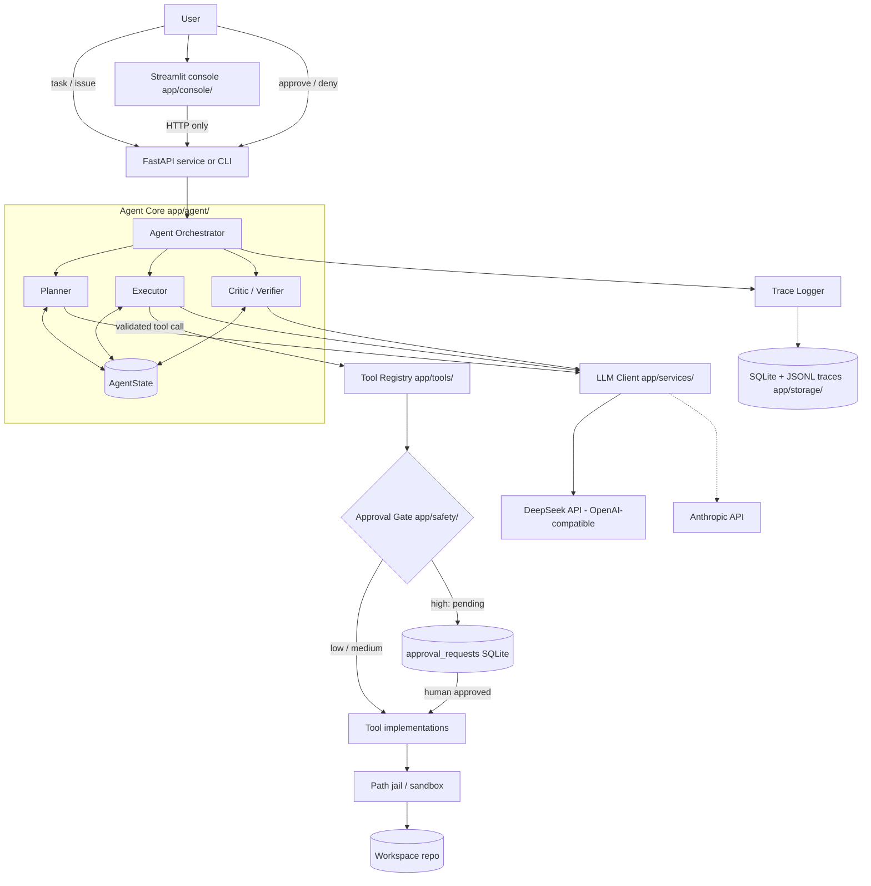
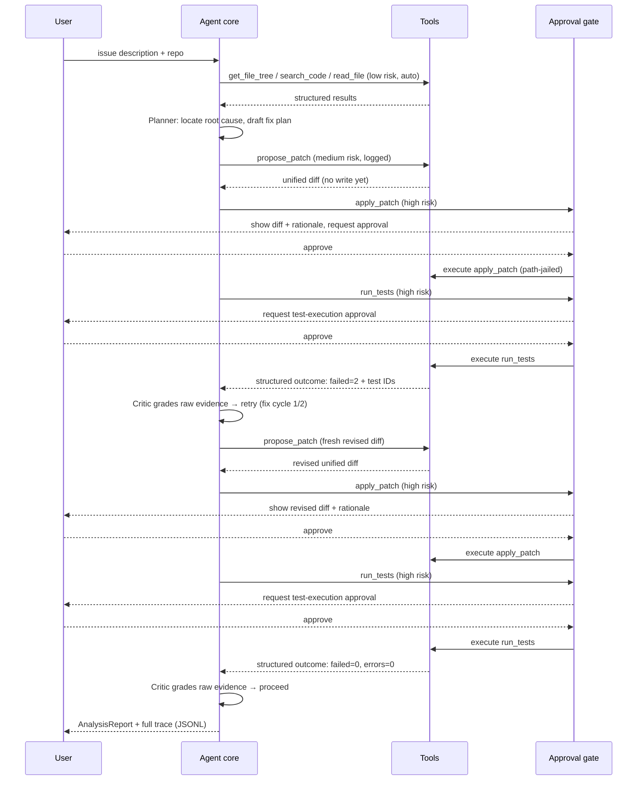

# Architecture

RepoPilot is a **task-oriented codebase agent**: given an issue or question about a registered
repository, it plans, calls tools, verifies results, asks a human before any mutation, and emits a
full execution trace. It is not a general chatbot.

## 1. Component overview



| Component | Location | Responsibility |
|---|---|---|
| Planner | `app/agent/planner.py` | Turn the task into an ordered `Plan` of steps, each with intent, candidate tools, and a `success_check`. Replans on Critic escalation. |
| Executor | `app/agent/executor.py` | Run one step as a constrained tool-calling micro-loop; validates args against schemas before dispatch. |
| Critic / Verifier | `app/agent/critic.py` | After each step: did the result satisfy `success_check`? Verdict: `proceed` / `retry` / `replan`. In fix cycles it grades the structured test outcome surfaced in raw evidence, independently of the Executor's summary (D-043). |
| Reporter | `app/agent/reporter.py` | Synthesize the task, outcome, final findings, timeline digest, and failure summary into a model-authored `AnalysisReport`; pure transform, emits no trace event. |
| AgentState | `app/agent/state.py` | Single source of truth: task, plan, step cursor, tool history, budgets, scratchpad summary, status. Persisted per run. |
| Orchestrator (loop) | `app/agent/loop.py` | The state machine driving Planner → Executor → Critic and finalizing through Reporter when configured, enforcing budgets and terminal states. |
| RunService | `app/api/service.py` | Create, dispatch, and read runs; assemble lifecycle views from SQLite and live events from JSONL; forward approval reads and decisions to the shared coordinator. |
| FastAPI app | `app/api/app.py` | HTTP surface: `POST /runs`, `GET /runs/{id}`, `GET /runs/{id}/events`, `GET /runs/{id}/stream` (SSE), `GET /runs`, `GET /approvals`, and `POST /approvals/{id}`. |
| Tool Registry | `app/tools/registry.py` | Registration (name, description, args/return schemas, `risk_level`, timeout), JSON-schema export for the LLM, and the **single dispatch chokepoint**. |
| Approval Gate | `app/safety/approval.py` | Intercepts every high-risk dispatch and blocks the calling stack until a human decision. Cannot be bypassed — it lives inside dispatch, not in the prompt. Approval timeout remains deferred. |
| ApprovalCoordinator / AsyncApprovalGate | `app/safety/async_approval.py` | Persist a durable approval request, expose a temporary `AWAITING_APPROVAL` read projection, and park the calling worker inside `check()` until an HTTP decision wakes its in-process waiter. Implements the existing `ApprovalGate` protocol. |
| Path Jail | `app/safety/path_jail.py` | Resolves every path against the registered workspace root; rejects traversal/symlink escapes. |
| LLM Client | `app/services/llm_client.py` | Provider-agnostic completion + tool-schema translation + usage/cost accounting. |
| Repo Manager | `app/services/repo_manager.py` | Register/clone repos into the workspace dir; branch management for patches. |
| Trace Logger | `app/storage/trace_store.py` | Append-only JSONL per run + indexed rows in SQLite. |
| Storage | `app/storage/db.py` | SQLAlchemy rows `_RunRow` (`runs`), `_StepRow` (`steps`), `_ToolCallRow` (`tool_calls`), and `_ApprovalRequestRow` (`approval_requests`). Reports remain JSONL events and are exposed at terminal state as a string summary; there is no `Report` row. |
| Streamlit console | `app/console/` | Two-process, HTTP-only archive and control surface. It does not import or connect directly to the database, JSONL store, registry, or approval coordinator (D-054). |

## 2. End-to-end flow (issue → verified patch)



## 3. Key interfaces

```python
class PlanStep(BaseModel):
    index: int
    intent: str                    # human-readable goal of this step
    suggested_tools: list[str]
    success_check: str             # criterion the Critic evaluates
    status: Literal["pending", "running", "done", "failed", "skipped"]

class AgentState(BaseModel):
    run_id: str
    task: TaskSpec                 # issue text, repo ref, task type
    plan: list[PlanStep]
    cursor: int
    tool_history: list[ToolTraceRecord]
    scratchpad: str                # rolling summary to control context growth
    budgets: Budgets               # max_steps, max_replans, max_fix_cycles, token/cost caps
    status: RunStatus              # see state machine in docs/agent-design.md
    steps_used: int
    replans_used: int
    fix_cycles_used: int

class TraceEvent(BaseModel):
    run_id: str
    seq: int
    ts: datetime
    kind: Literal["plan", "tool_call", "tool_result", "approval_request",
                  "approval_decision", "critic_verdict", "replan", "report", "error"]
    payload: dict                  # kind-specific, schema-validated before write
    latency_ms: int | None = None
    tokens_in: int | None = None
    tokens_out: int | None = None
    cost_usd: float | None = None
```

`ToolResult` / `ToolError` / `ToolMeta` are defined in `docs/code-style.md` §3 and live in
`app/schemas/tool_io.py`.

## 4. Data flow rules

1. **LLM output is never executed directly.** Tool calls are parsed, validated against the
   registered Pydantic schema, then dispatched through the registry chokepoint.
2. **All mutations flow through the approval gate.** Risk policy is data (`risk_level` on the
   spec), enforcement is code. Prompts remind the model about approvals, but the guarantee does
   not depend on the model.
3. **All paths flow through the jail.** Tools receive workspace-relative paths only.
4. **Everything is traced.** Every LLM call, tool call, approval, verdict, and replan appends a
   `TraceEvent`. The Phase 7 eval harness replays traces to compute metrics.
5. **Budgets terminate everything.** Steps, replans, fix cycles, wall-clock, and cost each have a
   cap; exhaustion produces a graceful `REPORTING` transition, never a silent stall.

## 5. Design principles

- **Boring core, sharp edges guarded**: the loop is a readable state machine, safety lives in two
  small modules (`approval.py`, `path_jail.py`) with exhaustive tests.
- **Schema-first**: adding a tool = one module + one registry entry; docs and LLM schemas are
  generated from the same source of truth.
- **Provider-agnostic**: swapping Claude ↔ DeepSeek is a `.env` change.
- **Trace-first**: if it isn't in the trace, it didn't happen (this powers eval + the UI).
