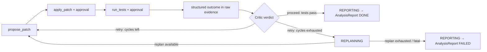

# Failure Recovery

> Recovery is a **routing decision on typed errors**, not a generic "try again". Every recovery
> action is budget-bounded and visible through existing verdict/replan events. Dedicated
> `recovery_of` links remain **post-P6 deferred (phase unassigned)**.

## 1. Error taxonomy → strategy

| Error type | Typical cause | Recovery strategy | Budget |
|---|---|---|---|
| `InvalidArgsError` (schema) | Model produced malformed/mistyped tool args | Feed the Pydantic validation message back verbatim; model repairs the call | 2 repairs per call, then step fails → Critic |
| Empty result (`ok=True`, empty payload) | Over-narrow search, wrong directory | Critic hint: broaden query / drop glob / try synonyms; counts as a normal step retry | 1 retry, then replan |
| `NotFoundError` / `BinaryFileError` | Hallucinated or stale path | Hint: re-run `get_file_tree`/`search_code` first; hallucinated-path incidents are counted per run | retry within step |
| `ToolTimeoutError` | A tool handler exceeds the registry deadline | Retry once with narrowed args when the tool supports narrowing; second timeout → replan with the constraint recorded in scratchpad | 1 |
| `PatchApplyError` | Diff drifted from file reality | Re-read the touched region → regenerate diff via `propose_patch` → new approval request | counts toward fix cycles |
| `GitError` | Repository or tracked-worktree state blocks branch preparation | Surface the blocker and enter REPORTING; never retry automatically or alter the user's worktree | 0 |
| Failing test result (`ok=True`, `failed > 0`) | Patch wrong or incomplete | Critic grades the structured `run_tests` outcome in raw evidence (counts + failing `test_id`s; messages omitted) and returns `retry`; the loop increments `fix_cycles_used` and retries the same step, then routes to replan when the cycle budget is exhausted | `REPOPILOT_MAX_FIX_CYCLES` (default 2) |
| `TestExecutionError` | The configured runner cannot start, times out, or produces no parseable JUnit result | Treat as an ordinary tool error for the Executor and Critic to route; there is no special fatal route as built, and one remains post-P6 deferred | normal step / replan budgets |
| `ApprovalDeniedError` | Human rejected the mutation | Executor terminates the denied step; the replan prompt carries the denied diff/call args plus a generic different-approach instruction. The human's free-text reason is persisted in the P7 `approval_decision` trace event as well as step findings, but is not threaded into the Planner | 2 denials → REPORTING |
| `LoopBlockedError` | Model repeated the same tool name and validated arguments consecutively within a run | Feed the block back to the model; it must change the tool or arguments before making another call | counts toward the step tool-call budget |
| LLM `refusal` stop reason | Safety refusal | Surface to user; run → FAILED with report. Never auto-retry refusals | 0 |
| LLM transport errors (429/5xx) | Rate limit, outage | Exponential backoff in the client (3 attempts), invisible to agent logic | 3 |
| `BudgetExceededError` | Steps/replans/cycles/cost cap | Graceful REPORTING with partial findings + explicit "what I'd try next" section | — |

## 2. The fix cycle (patch → test → fail → re-patch) — P6 as built

P6 shipped the approval-gated `run_tests` tool and the fix-only `LoopGuard`. The bounded retry
path was already part of the P3 agent loop; P6 wired the test tool and guard into the fix registry
rather than adding a second orchestrator. Fix runs still produce `AnalysisReport`; the dedicated
`FixReport` remains **post-P6 deferred (phase unassigned)**.

Rules: each cycle gets a **fresh diff** (no blind hunk tweaking). The loop appends each Critic retry
hint to the existing scratchpad, so the next attempt retains the accumulated recovery context.
Tests use the operator-configured `Settings.test_command` and `Settings.test_timeout_s`, loaded
from `REPOPILOT_TEST_COMMAND` and `REPOPILOT_TEST_TIMEOUT_S`; the model supplies only a rationale.
`LoopGuard` blocks an identical consecutive validated call before it can reach approval.

## 3. Anti-patterns explicitly designed out

- **Silent retry loops** — each retry is visible in a bounded `critic_verdict` route; dedicated
  `recovery_of` links remain post-P6 deferred. In P5, an approval denial terminates the Executor
  step, and the replan prompt discourages resubmitting the identical call or diff (D-039). The
  registry-level `LoopGuard` now hard-blocks identical consecutive calls before approval while
  leaving a `LoopBlockedError` trace.
- **Replan thrashing** — a replan must change the plan (diff against previous plan checked);
  a no-op replan is treated as budget exhaustion.
- **Error swallowing** — tools never raise to the loop and never return unstructured strings;
  everything is a `ToolError` with a model-actionable message.

## 4. What "graceful failure" delivers

A `FAILED` run still ships: what was tried (plan history), evidence gathered (citations),
why each attempt failed (typed errors + Critic summaries), and recommended next actions for a
human. Rationale: for a triage agent, *a well-argued failure report is a successful triage*.
P7 now measures both Recovery Success Rate and Graceful Failure Rate; see
`docs/evaluation.md` §4. The independent live recovery score was 0.000 (0/6): EVAL-005 proves the
recovery mechanism offline, while EVAL-006 shows that the live model did not recover in those runs.
