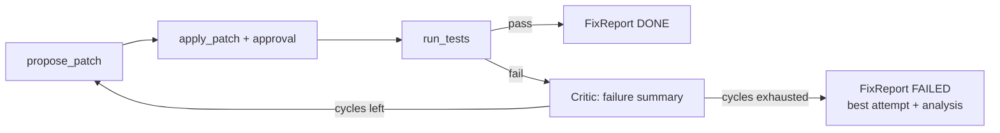

# Failure Recovery

> Recovery is a **routing decision on typed errors**, not a generic "try again". Every recovery
> action is bounded by a budget and traced with a `recovery_of` link to the failure it answers.

## 1. Error taxonomy → strategy

| Error type | Typical cause | Recovery strategy | Budget |
|---|---|---|---|
| `InvalidArgsError` (schema) | Model produced malformed/mistyped tool args | Feed the Pydantic validation message back verbatim; model repairs the call | 2 repairs per call, then step fails → Critic |
| Empty result (`ok=True`, empty payload) | Over-narrow search, wrong directory | Critic hint: broaden query / drop glob / try synonyms; counts as a normal step retry | 1 retry, then replan |
| `NotFoundError` / `BinaryFileError` | Hallucinated or stale path | Hint: re-run `get_file_tree`/`search_code` first; hallucinated-path incidents are counted per run | retry within step |
| `ToolTimeoutError` | Huge repo scan, runaway test | Retry once with narrowed args (smaller depth/glob); second timeout → replan with the constraint recorded in scratchpad | 1 |
| `PatchApplyError` | Diff drifted from file reality | Re-read the touched region → regenerate diff via `propose_patch` → new approval request | counts toward fix cycles |
| `GitError` | Repository or tracked-worktree state blocks branch preparation | Surface the blocker and enter REPORTING; never retry automatically or alter the user's worktree | 0 |
| `TestExecutionError` / failing tests | Patch wrong or incomplete | Critic distills failing assertions + stack traces into a *failure summary*; Planner replans a revised patch | `REPOPILOT_MAX_FIX_CYCLES` (default 2) |
| `ApprovalDeniedError` | Human rejected the mutation | Executor terminates the denied step; the replan prompt carries the denied diff/call args plus a generic different-approach instruction. The human's free-text reason remains in step findings until P7 audit | 2 denials → REPORTING |
| `LoopBlockedError` | Model repeated the same tool name and validated arguments consecutively within a run | Feed the block back to the model; it must change the tool or arguments before making another call | counts toward the step tool-call budget |
| LLM `refusal` stop reason | Safety refusal | Surface to user; run → FAILED with report. Never auto-retry refusals | 0 |
| LLM transport errors (429/5xx) | Rate limit, outage | Exponential backoff in the client (3 attempts), invisible to agent logic | 3 |
| `BudgetExceededError` | Steps/replans/cycles/cost cap | Graceful REPORTING with partial findings + explicit "what I'd try next" section | — |

## 2. The fix cycle (patch → test → fail → re-patch) — P6 planned

P6 is planned to add `run_tests` and the bounded cycle below. The target diagram retains
`FixReport`, but that dedicated report type remains deferred; P5 fix runs use `AnalysisReport`.

Rules: each cycle gets a **fresh diff** (no blind hunk tweaking); failure summaries accumulate in
the scratchpad so cycle 2 knows what cycle 1 broke; tests always run the *same command* discovered
via `get_repo_overview` (or task config) so results are comparable.

## 3. Anti-patterns explicitly designed out

- **Silent retry loops** — every retry is a trace event with `recovery_of`. In P5, an approval
  denial terminates the Executor step, and the replan prompt discourages resubmitting the identical
  call or diff (D-039). The registry-level `LoopGuard` now hard-blocks identical consecutive calls
  before approval while leaving a `LoopBlockedError` trace.
- **Replan thrashing** — a replan must change the plan (diff against previous plan checked);
  a no-op replan is treated as budget exhaustion.
- **Error swallowing** — tools never raise to the loop and never return unstructured strings;
  everything is a `ToolError` with a model-actionable message.

## 4. What "graceful failure" delivers

A `FAILED` run still ships: what was tried (plan history), evidence gathered (citations),
why each attempt failed (typed errors + Critic summaries), and recommended next actions for a
human. Rationale: for a triage agent, *a well-argued failure report is a successful triage*.
This is measured in eval as Recovery Success Rate and Graceful Failure Rate.
