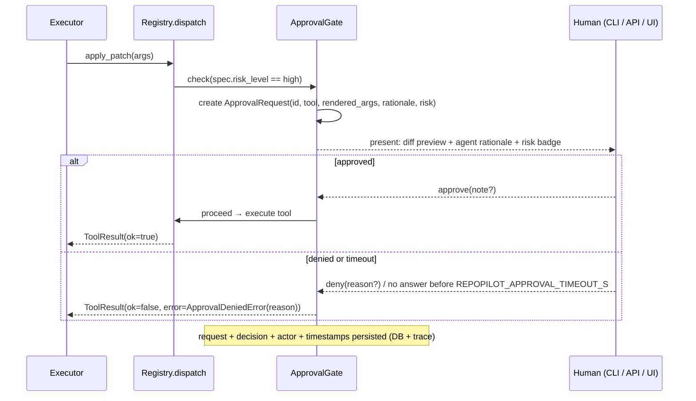

# Human-in-the-Loop Safety

> Core claim: **the model is never trusted to police itself.** Risk policy is declared as data on
> each `ToolSpec`; enforcement happens in code, inside the registry dispatch path, where it cannot
> be prompted away.

## 1. Risk levels

| Level | Definition | Examples | Gate behavior |
|---|---|---|---|
| `low` | Read-only inside the path jail; no side effects | `get_file_tree`, `read_file`, `search_code` | Auto-execute, traced |
| `medium` | Produces artifacts but mutates nothing outside the run's own record | `propose_patch` (diff generation) | Auto-execute, traced **and** surfaced in the run timeline |
| `high` | Mutates workspace files, git state, or executes code | `apply_patch`, `run_tests`, `git_create_branch`, `git_commit` | **Blocked until explicit human approval** |

Classification rules of thumb: writes bytes → high; spawns a process → high; git mutation → high
(per project hard rules); anything ambiguous → the higher level.

## 2. Approval flow

Presentation requirements per request: tool name, risk badge, **human-readable rendering of args**
(for `apply_patch`: the actual diff), the agent's `rationale`, and run context (task, step intent).

## 3. Decision semantics

- **Approve** — optionally with a note; executes exactly the request presented (args are frozen at
  request time; any change requires a new request).
- **Deny** — reason is injected into the agent context as a structured `ApprovalDeniedError`.
  The agent must not re-submit an identical call; the Planner produces an alternative or the run
  moves to REPORTING. Two denials in one run → forced REPORTING.
- **Timeout** — equals deny with reason `"approval timed out"`. Default
  `REPOPILOT_APPROVAL_TIMEOUT_S=600` (CLI mode blocks interactively instead).

## 4. Surfaces

| Surface | Phase | Mechanism |
|---|---|---|
| CLI | P5 | Interactive prompt with colored diff (`rich`), y/n/note |
| REST API | P8 | `GET /approvals?status=pending`, `POST /approvals/{id}` `{decision, note}` — run is suspended (`AWAITING_APPROVAL`) meanwhile |
| Streamlit UI | P8 | Pending-approval panel with diff viewer and approve/deny buttons |

## 5. Non-bypassability (tested property, not a promise)

1. The gate lives **inside `registry.dispatch`** — there is no second code path to a tool impl.
   Tool impl functions are private to their modules; only the registry imports them.
2. Config cannot disable the gate for `high` (no such flag exists). The only softening is
   `auto_approve_tests_in_sandbox` which applies to `run_tests` inside Docker only, and it still
   records an `approval_decision` trace event with `actor="policy:sandbox"`.
3. **Tests must mock the gate, never bypass it** (project hard rule): unit tests patch
   `ApprovalGate.check` with an auto-approve fake and *assert it was called* for every high-risk
   dispatch. A dedicated test registers a dummy high-risk tool and asserts dispatch without
   approval is impossible.

## 6. Audit trail

Every request/decision is stored twice: rows in `approval_requests` (queryable) and
`approval_request` / `approval_decision` events in the run trace (replayable). Fields: request id,
run id, step, tool, args hash + rendered form, rationale, risk, decision, actor, note, latencies.
The eval harness computes **Human Approval Trigger Rate** from these events.
